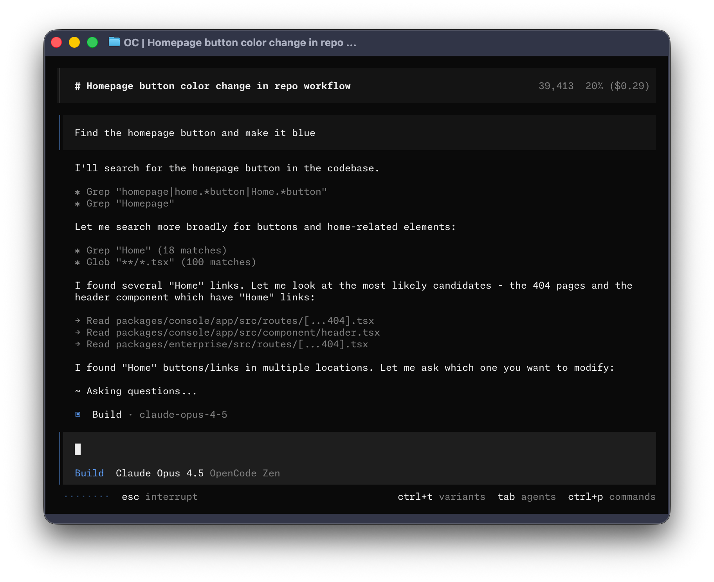

<p align="center">
  <a href="https://opencode.ai">
    <picture>
      <source srcset="packages/console/app/src/asset/logo-ornate-dark.svg" media="(prefers-color-scheme: dark)">
      <source srcset="packages/console/app/src/asset/logo-ornate-light.svg" media="(prefers-color-scheme: light)">
      
    </picture>
  </a>
</p>
<<<<<<< HEAD
<p align="center">AI coding agent, built for the terminal.</p>
||||||| 7269c2316
<p align="center">The AI coding agent built for the terminal.</p>
=======
<p align="center">The open source AI coding agent.</p>
>>>>>>> dev
<p align="center">
  <a href="https://opencode.ai/discord"></a>
  <a href="https://www.npmjs.com/package/opencode-ai"></a>
  <a href="https://github.com/anomalyco/opencode/actions/workflows/publish.yml"></a>
</p>

[](https://opencode.ai)

AI-powered terminal assistant for software developers.

## Installation

### One-line install (Recommended)
```bash
<<<<<<< HEAD
curl -fsSL https://raw.githubusercontent.com/lacymorrow/lash/main/install | bash
||||||| 7269c2316
# YOLO
curl -fsSL https://opencode.ai/install | bash

# Package managers
npm i -g opencode-ai@latest        # or bun/pnpm/yarn
scoop bucket add extras; scoop install extras/opencode  # Windows
choco install opencode             # Windows
brew install opencode      # macOS and Linux
paru -S opencode-bin               # Arch Linux
=======
# YOLO
curl -fsSL https://opencode.ai/install | bash

# Package managers
npm i -g opencode-ai@latest        # or bun/pnpm/yarn
scoop bucket add extras; scoop install extras/opencode  # Windows
choco install opencode             # Windows
brew install anomalyco/tap/opencode # macOS and Linux (recommended, always up to date)
brew install opencode              # macOS and Linux (official brew formula, updated less)
paru -S opencode-bin               # Arch Linux
mise use -g opencode               # Any OS
nix run nixpkgs#opencode           # or github:anomalyco/opencode for latest dev branch
>>>>>>> dev
```

<<<<<<< HEAD
### Homebrew
||||||| 7269c2316
> [!TIP]
> Remove versions older than 0.1.x before installing.

#### Installation Directory

The install script respects the following priority order for the installation path:

1. `$OPENCODE_INSTALL_DIR` - Custom installation directory
2. `$XDG_BIN_DIR` - XDG Base Directory Specification compliant path
3. `$HOME/bin` - Standard user binary directory (if exists or can be created)
4. `$HOME/.opencode/bin` - Default fallback

=======
> [!TIP]
> Remove versions older than 0.1.x before installing.

### Desktop App (BETA)

OpenCode is also available as a desktop application. Download directly from the [releases page](https://github.com/anomalyco/opencode/releases) or [opencode.ai/download](https://opencode.ai/download).

| Platform              | Download                              |
| --------------------- | ------------------------------------- |
| macOS (Apple Silicon) | `opencode-desktop-darwin-aarch64.dmg` |
| macOS (Intel)         | `opencode-desktop-darwin-x64.dmg`     |
| Windows               | `opencode-desktop-windows-x64.exe`    |
| Linux                 | `.deb`, `.rpm`, or AppImage           |

```bash
# macOS (Homebrew)
brew install --cask opencode-desktop
```

#### Installation Directory

The install script respects the following priority order for the installation path:

1. `$OPENCODE_INSTALL_DIR` - Custom installation directory
2. `$XDG_BIN_DIR` - XDG Base Directory Specification compliant path
3. `$HOME/bin` - Standard user binary directory (if exists or can be created)
4. `$HOME/.opencode/bin` - Default fallback

>>>>>>> dev
```bash
brew install lacymorrow/tap/lash
```

### Agents

OpenCode includes two built-in agents you can switch between with the `Tab` key.

- **build** - Default, full access agent for development work
- **plan** - Read-only agent for analysis and code exploration
  - Denies file edits by default
  - Asks permission before running bash commands
  - Ideal for exploring unfamiliar codebases or planning changes

Also, included is a **general** subagent for complex searches and multistep tasks.
This is used internally and can be invoked using `@general` in messages.

Learn more about [agents](https://opencode.ai/docs/agents).

### Documentation

For more info on how to configure Lash [**head over to our docs**](https://opencode.ai/docs).

### Contributing

Lash is an opinionated tool so any fundamental feature needs to go through a
design process with the core team.

<<<<<<< HEAD
> [!IMPORTANT]
> We do not accept PRs for core features.
||||||| 7269c2316
### FAQ
=======
### Building on OpenCode

If you are working on a project that's related to OpenCode and is using "opencode" as a part of its name; for example, "opencode-dashboard" or "opencode-mobile", please add a note to your README to clarify that it is not built by the OpenCode team and is not affiliated with us in any way.

### FAQ
>>>>>>> dev

<<<<<<< HEAD
However we still merge a ton of PRs - you can contribute:
||||||| 7269c2316
#### How is this different than Claude Code?
=======
#### How is this different from Claude Code?
>>>>>>> dev

- Bug fixes
- Improvements to LLM performance
- Support for new providers
- Fixes for env specific quirks
- Missing standard behavior
- Documentation

Take a look at the git history to see what kind of PRs we end up merging.

> [!NOTE]
> If you do not follow the above guidelines we might close your PR.

To run Lash locally you need.

- Bun 1.3 or higher
- Golang 1.24.x

And run.
```bash
bun install
bun dev
```

### From Source
```bash
git clone https://github.com/lacymorrow/lash
cd lash/packages/opencode
bun install
bun run dev
```

**API Client**: After making changes to the TypeScript API endpoints in `packages/opencode/src/server/server.ts`, you will need the Lash team to generate a new stainless sdk for the clients.


## Usage

```bash
lash --help
```

## Features

- 100% open source
<<<<<<< HEAD
- Not coupled to any provider. Although Anthropic is recommended, Lash can be used with OpenAI, Google or even local models. As models evolve the gaps between them will close and pricing will drop so being provider-agnostic is important.
||||||| 7269c2316
- Not coupled to any provider. Although Anthropic is recommended, OpenCode can be used with OpenAI, Google or even local models. As models evolve the gaps between them will close and pricing will drop so being provider-agnostic is important.
=======
- Not coupled to any provider. Although we recommend the models we provide through [OpenCode Zen](https://opencode.ai/zen); OpenCode can be used with Claude, OpenAI, Google or even local models. As models evolve the gaps between them will close and pricing will drop so being provider-agnostic is important.
>>>>>>> dev
- Out of the box LSP support
- A focus on TUI. Lash is built by neovim users and the creators of [terminal.shop](https://terminal.shop); we are going to push the limits of what's possible in the terminal.
- A client/server architecture. This for example can allow Lash to run on your computer, while you can drive it remotely from a mobile app. Meaning that the TUI frontend is just one of the possible clients.

<<<<<<< HEAD
## License

MIT

||||||| 7269c2316
#### What's the other repo?

The other confusingly named repo has no relation to this one. You can [read the story behind it here](https://x.com/thdxr/status/1933561254481666466).

=======
>>>>>>> dev
---

**Join our community** [Discord](https://discord.gg/opencode) | [X.com](https://x.com/opencode)
